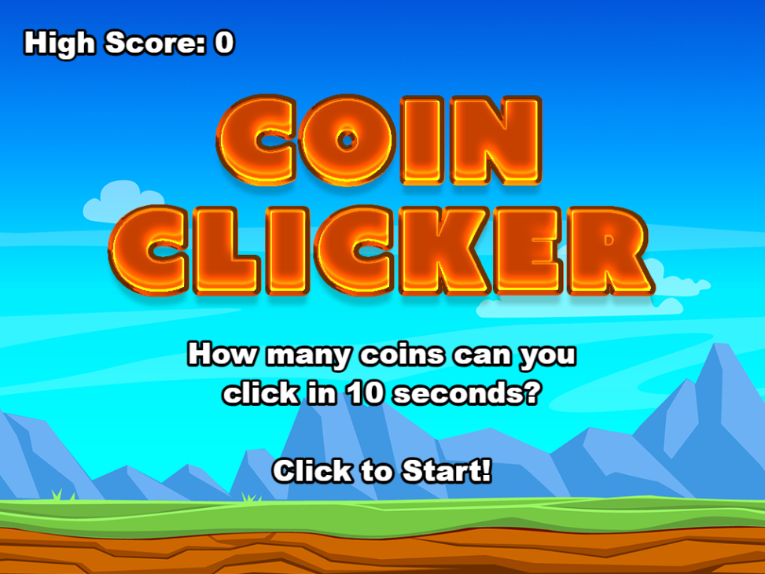

# Coin Clicker (Tri des Déchets)

Ce jeu consiste à trier correctement les déchets en cliquant sur le déchet, puis sur la poubelle appropriée.

## Instructions

1. Clonez le dépôt.
2. Installez les dépendances avec `npm install`.
3. Lancez le serveur de développement avec `npm run dev`.
4. Cliquez sur les déchets et triez-les correctement dans les poubelles.
5. Si tous les déchets sont triés, un nouveau cycle commence.

